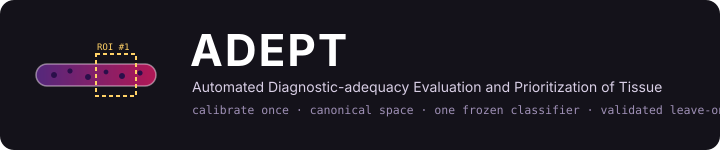

<p align="center">
  
</p>

# ADEPT — Automated Diagnostic-adequacy Evaluation and Prioritization of Tissue

[](https://github.com/sjarso1/adept-microscopy/actions/workflows/ci.yml)
[](LICENSE)
[](pyproject.toml)
[](docs/reporting/)

**Closed-loop autonomous microscopy for breast-biopsy telepathology, built on the ~$250 open-source [OpenFlexure](https://openflexure.org) microscope — designed so that the scarcest resource in an LMIC pathology service, consultant reading time, is never spent on a non-diagnostic (B1) specimen.**

ADEPT scans a core-needle biopsy slide at low magnification, scores it against five formal adequacy criteria (**tissue, cellularity, staining, focus, freedom from artifact**), drives the stage back to re-scan poor regions, and then captures targeted high-resolution tiles at the regions a pathologist would want to see first. The output is an adequacy report, a navigable mosaic, and a ranked tile package for remote review.

> The system decides whether a slide is **readable** and **where to look**. The diagnosis remains, at every stage, the pathologist's.

---

## Why multi-instrument translatability is the design principle

A model that works only on the microscope it was trained on does not solve the deployment problem — it relocates it. ADEPT separates what is instrument-specific from what is not:

1. **Calibrate once.** Each microscope is characterised with a cheap, label-free calibration kit (pure-H, pure-E and blank slides; a resolution target; an illumination reference), yielding a per-instrument stain-deconvolution matrix, spectral correction factors, and an illumination flat-field.
2. **Map into a canonical image space.** Raw instrument colour never reaches a model. Every image is mapped into canonical space before any measurement or learning.
3. **Train and freeze one classifier** in canonical space.
4. **Validate leave-one-instrument-out (LOIO).** Every model is trained with one acquisition system entirely held out, then tested on it — translatability is *measured*, not assumed.

Onboarding a new microscope therefore costs a **calibration session, not a retraining project**. See [`docs/protocols/new_instrument_onboarding.md`](docs/protocols/new_instrument_onboarding.md).

## Repository map

```
adept-microscopy/
├── src/adept/
│   ├── calibration/   # OD transform, Macenko stain vectors, flat-field, spectral correction, canonical mapping
│   ├── criteria/      # The five adequacy criteria as canonical-space measurement modules
│   ├── data/          # Slide registry, no-leakage stratified splits, LOIO folds, synthetic data
│   ├── eval/          # Sensitivity/specificity/AUROC/κ with bootstrap CIs; invariance; envelope sweeps
│   ├── models/        # Adequacy classifier, ROI ranking, MIL suspicion model (torch optional)
│   ├── pipeline/      # Inference API (calibration front-end as a swappable stage) and output packages
│   ├── schema/        # Pydantic output schema: AdequacyReport, ROI list, SuspicionReport
│   └── cli/           # `adept` command-line interface
├── configs/           # Instrument calibrations, model and experiment configs (YAML)
├── docs/              # Architecture, roadmap, protocols, reporting checklists, decision records
├── tests/             # pytest suite (runs on synthetic data, no GPU required)
├── scripts/           # Reproducible experiment entry points (one per deliverable)
├── notebooks/         # Exploration notebooks (kept light; results live in scripts + reports)
├── data/              # Local data roots (git-ignored; see docs/data_governance.md)
└── artifacts/         # Calibrations, weights, packages (git-ignored except small calibration JSON)
```

## Quick start

```bash
git clone https://github.com/sjarso1/adept-microscopy.git
cd adept-microscopy
python -m venv .venv && source .venv/bin/activate
pip install -e ".[dev]"          # add ,torch for the deep-learning stack
pytest                           # ~seconds; runs on synthetic slides
```

Run the whole Semester-1 loop on a **synthetic** multi-instrument dataset (no real images needed):

```bash
adept synth make-dataset --out data/synth --n-slides 40 --instruments openflexure,printed3d,scanner
adept calibrate derive  --kit data/synth/kits/openflexure --instrument openflexure --out artifacts/calibrations/openflexure.json
adept calibrate derive  --kit data/synth/kits/scanner     --instrument scanner     --out artifacts/calibrations/scanner.json
adept calibrate validate --pairs data/synth/pairs.csv --calibrations artifacts/calibrations   # inter- vs intra-instrument residuals
adept assess run --image data/synth/slides/S0001_openflexure.png \
                 --calibration artifacts/calibrations/openflexure.json --out report.json
adept splits make --registry data/synth/registry.csv --out data/splits/s1_locked.json --seed 7
adept eval loio  --registry data/synth/registry.csv --predictions preds.csv                  # LOIO metrics with 95% bootstrap CIs
```

Each command is thin: the logic lives in importable modules so the same code path runs in notebooks, scripts and CI.

## The five adequacy criteria

| # | Criterion | Measurement (canonical space) | Module |
|---|-----------|-------------------------------|--------|
| 1 | **Tissue** | Connected-component core detection; core count and total length | `criteria.tissue` |
| 2 | **Cellularity** | Nucleus density per tissue area (haematoxylin-channel nuclei; pluggable DL detector) | `criteria.cellularity` |
| 3 | **Staining** | Calibrated H/E optical-density ratio, measured *before* normalisation so true stain failures are not erased | `criteria.staining` |
| 4 | **Focus** | Tile-wise sharpness map (Laplacian variance) with per-instrument calibration | `criteria.focus` |
| 5 | **Artifact** | Fold / bubble / crush / desiccation detection with mask output | `criteria.artifact` |

The five measurements are assembled into an [`AdequacyReport`](src/adept/schema/report.py) (adequate B2+ vs inadequate B1, with reason codes) and a ranked ROI list.

## Performance budget

| Task | Sensitivity | Specificity | AUROC | Concordance |
|------|-------------|-------------|-------|-------------|
| Adequacy (B1 detection), Semesters 1–2 | ≥ 0.90 | ≥ 0.85 | ≥ 0.92 | κ ≥ 0.75 vs. pathologist |
| Malignancy-suspicion triage, Semester 3 | ≥ 0.95 | ≥ 0.80 | ≥ 0.90 | top-tile hit-rate ≥ 0.80 vs. pathologist-marked regions |

Sensitivity dominates because the costly error is calling an inadequate slide adequate — that is the error that sends a non-diagnostic slide to a scarce remote pathologist. Every number is reported on a **locked, site- and instrument-stratified held-out split** with bootstrap 95% CIs; no physical slide ever crosses a split via a different instrument. Reporting follows [TRIPOD-AI](docs/reporting/TRIPOD-AI_checklist.md) and [STARD](docs/reporting/STARD_checklist.md).

## Research roadmap

| Semester | Theme | Headline deliverable |
|----------|-------|----------------------|
| **1** | Instrument calibration, canonical space, five-criterion adequacy classifier | Classifier concordance with the expert on every instrument; per-criterion ablation |
| **2** | Cross-instrument generalisation, envelope characterisation, integration | LOIO gap; per-instrument vs pooled vs canonical vs foundation-encoder decision; stain/focus/illumination envelope; inference API + onboarding protocol; Zenodo dataset |
| **3** | Malignancy-suspicion triage (MIL) with cross-instrument validation | Attention-anchored suspicion score folded into ROI ranking; attention stability across instruments |

Full detail, endpoints and week-by-week plans: [`docs/roadmap.md`](docs/roadmap.md).

## Data, ethics and openness

No patient images or labels are stored in this repository. Real data live under `data/` (git-ignored) and are governed by the project's ethics approvals; see [`docs/data_governance.md`](docs/data_governance.md). The annotated multi-instrument dataset, calibration protocols and trained weights are released on **Zenodo** at each semester archive tag.

## Team

Sponsor **Dr. Tonny Okecha** (Uganda Cancer Institute, Pathology) · Clinical lead **Dr. Samuel Kalungi** (Mulago National Referral Hospital) · AI lead **Dr. Andrew Katumba** (Makerere University, CEDAT) · BME lead & research advisor **Dr. Samson Jarso** (Johns Hopkins University, BME) · Consultant **Dr. Raymond Atwine** (UCI Mbarara) · Student researcher **Bruno Beijuka** (Makerere University), with a parallel hardware workstream on stage characterisation and autofocus.

## Citing

See [`CITATION.cff`](CITATION.cff). Contributions welcome — read [`CONTRIBUTING.md`](CONTRIBUTING.md) first.

## License

Code is released under the [MIT License](LICENSE). Data and trained weights are released separately on Zenodo under their own licenses.
